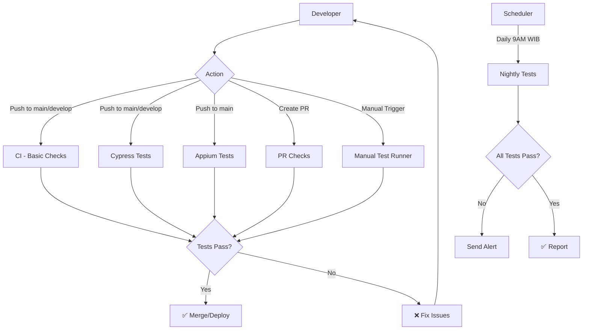

# 📊 Workflow Diagram & Visual Guide

## 🔄 Workflow Trigger Flow



## 🎯 Workflow Overview

### 1️⃣ CI - Basic Checks

```
┌─────────────────────────────────────────┐
│   CI - Basic Checks                      │
├─────────────────────────────────────────┤
│                                          │
│  Triggers:                               │
│  • Push to main/develop                  │
│  • Pull Request                          │
│                                          │
│  Jobs:                                   │
│  ├─ Lint and Type Check                 │
│  │  ├─ TypeScript Check (Appium)        │
│  │  ├─ TypeScript Check (Cypress)       │
│  │  └─ Verify Dependencies              │
│  │                                       │
│  └─ Security Audit                       │
│     ├─ npm audit                         │
│     └─ Check outdated packages          │
│                                          │
│  Duration: ~2-3 minutes                  │
│  Runner: ubuntu-latest                   │
│  Node: 18.x, 20.x (matrix)              │
└─────────────────────────────────────────┘
```

### 2️⃣ Cypress E2E Tests

```
┌─────────────────────────────────────────┐
│   Cypress E2E Tests                      │
├─────────────────────────────────────────┤
│                                          │
│  Triggers:                               │
│  • Push to main/develop                  │
│  • Pull Request                          │
│  • Manual (workflow_dispatch)            │
│                                          │
│  Jobs:                                   │
│  └─ Cypress Run (Matrix)                 │
│     ├─ Chrome Browser                    │
│     ├─ Firefox Browser                   │
│     └─ Edge Browser                      │
│                                          │
│  Artifacts:                              │
│  ├─ Screenshots (on failure)             │
│  ├─ Videos (all runs)                    │
│  └─ Test Reports                         │
│                                          │
│  Duration: ~5-10 minutes per browser     │
│  Runner: ubuntu-latest                   │
└─────────────────────────────────────────┘
```

### 3️⃣ Appium Android Tests

```
┌─────────────────────────────────────────┐
│   Appium Android Tests                   │
├─────────────────────────────────────────┤
│                                          │
│  Triggers:                               │
│  • Push to main                          │
│  • Manual (with API level choice)        │
│                                          │
│  Setup:                                  │
│  ├─ Install Appium                       │
│  ├─ Setup Android SDK                    │
│  ├─ Create/Cache AVD                     │
│  └─ Start Emulator                       │
│                                          │
│  Jobs:                                   │
│  └─ Run Appium Tests                     │
│     ├─ Start Appium Server               │
│     ├─ Boot Android Emulator             │
│     ├─ Execute Test Specs                │
│     └─ Collect Artifacts                 │
│                                          │
│  Artifacts:                              │
│  ├─ Appium Logs                          │
│  ├─ Screenshots                          │
│  └─ Test Reports                         │
│                                          │
│  Duration: ~30-45 minutes                │
│  Runner: macos-latest (required!)        │
│  API Level: 30 (default)                 │
└─────────────────────────────────────────┘
```

### 4️⃣ Nightly Full Test Suite

```
┌─────────────────────────────────────────┐
│   Nightly Full Test Suite                │
├─────────────────────────────────────────┤
│                                          │
│  Triggers:                               │
│  • Schedule: Daily at 2AM UTC (9AM WIB)  │
│  • Manual (workflow_dispatch)            │
│                                          │
│  Jobs:                                   │
│  ├─ Run Cypress Tests                    │
│  │  └─ All browsers                      │
│  │                                       │
│  ├─ Run Appium Tests                     │
│  │  └─ All test specs                    │
│  │                                       │
│  └─ Generate Summary                     │
│     ├─ Combine Results                   │
│     ├─ Create Report                     │
│     └─ (Optional) Send Notification      │
│                                          │
│  Duration: ~60-90 minutes                │
│  Runner: macos-latest                    │
└─────────────────────────────────────────┘
```

### 5️⃣ Manual Test Runner

```
┌─────────────────────────────────────────┐
│   Manual Test Runner                     │
├─────────────────────────────────────────┤
│                                          │
│  Triggers:                               │
│  • Manual only (workflow_dispatch)       │
│                                          │
│  Inputs:                                 │
│  ├─ Test Type                            │
│  │  ├─ appium-all                        │
│  │  ├─ appium-specific                   │
│  │  ├─ cypress-all                       │
│  │  └─ cypress-specific                  │
│  │                                       │
│  ├─ Test Spec (optional)                 │
│  ├─ Browser (for Cypress)                │
│  ├─ API Level (for Appium)               │
│  └─ Enable Video Recording               │
│                                          │
│  Duration: Varies by selection           │
│  Runner: ubuntu/macos (based on type)    │
└─────────────────────────────────────────┘
```

## 📈 Workflow Execution Timeline

```
Timeline for Push to main:

T+0s    ┌──────────────────────────┐
        │ Push to main branch       │
        └──────────────────────────┘
                 ↓
T+5s    ┌──────────────────────────┐
        │ Trigger Workflows         │
        │ • CI - Basic Checks       │
        │ • Cypress Tests           │
        │ • Appium Tests            │
        └──────────────────────────┘
                 ↓
T+10s   ┌──────────────────────────┐
        │ Setup & Install           │
        │ • Clone repo              │
        │ • Setup Node.js           │
        │ • npm ci (cached)         │
        └──────────────────────────┘
                 ↓
T+2m    ┌──────────────────────────┐
        │ ✅ CI Checks Complete     │
        └──────────────────────────┘
                 ↓
T+10m   ┌──────────────────────────┐
        │ ✅ Cypress Tests Complete │
        └──────────────────────────┘
                 ↓
T+45m   ┌──────────────────────────┐
        │ ✅ Appium Tests Complete  │
        └──────────────────────────┘
                 ↓
        ┌──────────────────────────┐
        │ All Checks Passed ✅      │
        │ Ready to Deploy           │
        └──────────────────────────┘
```

## 🎭 Workflow States

```
┌────────────┐
│  Queued    │  ⏳ Waiting for runner
└────────────┘
      ↓
┌────────────┐
│ In Progress│  🔄 Running tests
└────────────┘
      ↓
┌────────────┐     ┌────────────┐
│  Success   │  or │  Failure   │
│     ✅     │     │     ❌     │
└────────────┘     └────────────┘
```

## 🔐 Secrets Flow

```
GitHub Secrets
      ↓
┌─────────────────┐
│ Repository      │
│ Settings        │
└─────────────────┘
      ↓
┌─────────────────┐
│ Workflow File   │
│ (*.yml)         │
└─────────────────┘
      ↓
┌─────────────────┐
│ Environment     │
│ Variables       │
└─────────────────┘
      ↓
┌─────────────────┐
│ Test Execution  │
└─────────────────┘
```

## 📦 Artifacts Lifecycle

```
Test Execution
      ↓
Generate Artifacts
├─ Screenshots
├─ Videos
├─ Logs
└─ Reports
      ↓
Upload to GitHub
      ↓
Available for 90 days
      ↓
Auto-delete or
Manual download
```

## 🔄 Pull Request Workflow

```
Feature Branch
      ↓
Create Pull Request
      ↓
┌─────────────────────────────┐
│ Trigger CI Checks            │
│ ├─ Basic Checks             │
│ └─ Cypress Tests            │
└─────────────────────────────┘
      ↓
┌─────────────────────────────┐
│ Status Checks               │
│ • All checks must pass      │
│ • Branch up to date         │
└─────────────────────────────┘
      ↓
     Pass?
    ↙    ↘
  Yes      No
   ↓        ↓
Merge   Fix Issues
   ↓        ↓
  main   Push Fix
           ↓
      Re-run Checks
```

## 🎯 Decision Matrix

### When to Use Each Workflow?

| Scenario | Workflow | Why |
|----------|----------|-----|
| Quick code change | CI - Basic Checks | Fast feedback (2-3 min) |
| UI changes | Cypress Tests | Test web interface |
| Mobile features | Appium Tests | Test mobile app |
| Before release | Nightly Tests | Full regression |
| Debug specific test | Manual Runner | Targeted testing |
| Daily health check | Nightly Tests | Automated monitoring |

## 📊 Resource Usage

```
Workflow            Runner          Duration    Minutes Used
──────────────────────────────────────────────────────────────
CI - Basic         ubuntu-latest    ~3 min      3
Cypress (3 browsers) ubuntu-latest  ~15 min     15
Appium             macos-latest     ~45 min     90 (2x multiplier)
Nightly            macos-latest     ~90 min     180 (2x multiplier)
──────────────────────────────────────────────────────────────

Note: macOS runners use 2x minutes
      GitHub Free: 2,000 minutes/month
```

## 🎨 Visualization Legend

```
┌────────┐
│ Box    │  Represents a workflow/job/step
└────────┘

    ↓       Flow direction

   ┌─┐
   │ │      Sequential execution
   └─┘

Matrix      Parallel execution
├─ Item 1
├─ Item 2
└─ Item 3

✅          Success state
❌          Failure state
⏳          Queued/Pending
🔄          In Progress
```

---

**Note:** Diagrams dapat di-render dengan Mermaid di GitHub, GitLab, atau Markdown viewers yang support Mermaid syntax.

